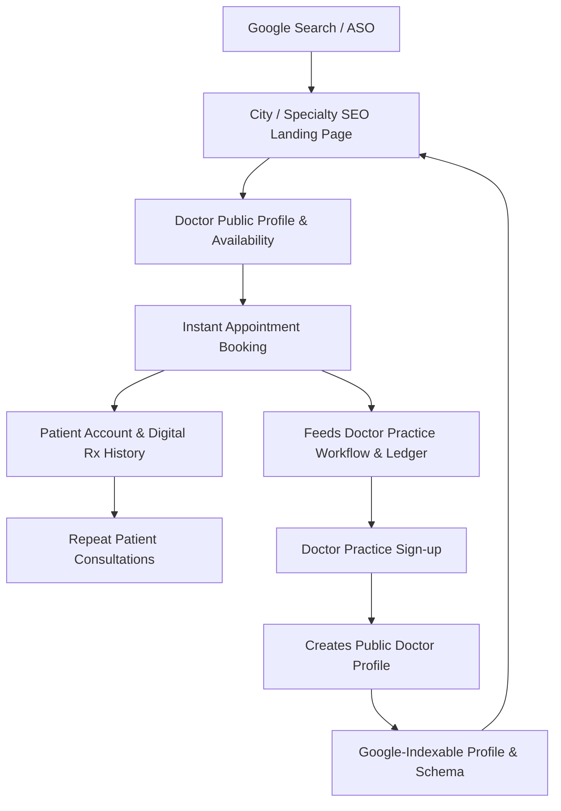

# DOCCARE — Comprehensive ASO & SEO Growth Strategy for Pakistan

## 1. Executive Summary & Positioning Architecture

DocCare is positioned primarily as **Pakistan's premier Doctor Discovery and Appointment Booking Platform**, with the authenticated **Private Doctor Practice Portal** functioning as the core supply-side differentiator.

### The Two-Sided Value Proposition:
- **Patient Proposition**: Find the right PMDC-verified doctor in your city, check specialty, consultation fee, and real-time appointment availability, and book your visit instantly with English + Urdu RTL support.
- **Doctor Proposition**: A private digital practice operating system for managing patient health records, clinical consultations, automated digital prescriptions, appointment queues, and ledger accounting.

---

## 2. Store Metadata (Exact Character Counts)

### Apple App Store Metadata
| Field | Content | Character Count | Limit |
| :--- | :--- | :--- | :--- |
| **App Title** | `DocCare - Find Doctors` | **22** | 30 |
| **Subtitle** | `Book Appointments Near You` | **27** | 30 |
| **iOS Keywords** | `clinic,medical,healthcare,pakistan,physician,specialist,consultation,city,online,nearby,booking` | **94** | 100 |

#### Apple Store Localization (Urdu):
- **Title (Urdu)**: `DocCare - ڈاکٹر تلاش کریں` (24 / 30)
- **Subtitle (Urdu)**: `آن لائن اپائنٹمنٹ بک کریں` (24 / 30)
- **Urdu Search Keywords**: `ڈاکٹر,ڈاکٹر تلاش کریں,ڈاکٹر کی اپائنٹمنٹ,ڈاکٹر سے مشورہ,قریبی ڈاکٹر,ماہر ڈاکٹر,آن لائن ڈاکٹر`

---

### Google Play Store Metadata
| Field | Content | Character Count | Limit |
| :--- | :--- | :--- | :--- |
| **App Name** | `DocCare - Find Doctors` | **22** | 30 |
| **Short Description** | `Find doctors, check fees & availability, and book appointments in Pakistan.` | **76** | 80 |

#### Google Play Long Description (Complete Production Copy):
```text
DOC CARE — FIND DOCTORS & BOOK APPOINTMENTS IN PAKISTAN

Find doctors in Pakistan by city and specialty, view doctor profiles, check consultation fees and available appointment times, and book your appointment through DocCare.

Whether you need a general physician or a specialist, DocCare helps you discover doctors and manage your appointments from your phone.

FIND A DOCTOR
Search for doctors by:
• City
• Specialty
• Doctor name
• Clinic
• Availability

Find doctors in cities including Lahore, Karachi, Islamabad, Rawalpindi, Faisalabad, Multan, Peshawar and other Pakistani cities.

CHECK DOCTOR PROFILES
View public doctor information including:
• Doctor name
• Specialty
• Qualifications
• Clinic
• City
• Consultation fee
• Available appointment times

BOOK A DOCTOR APPOINTMENT
Choose your:
• Doctor
• Date
• Available time
• Contact information

Then submit your appointment request and receive an appointment confirmation.

FIND SPECIALIST DOCTORS
Discover specialists such as:
• Cardiologists
• Dermatologists
• Gynecologists
• Pediatricians
• Orthopedic specialists
• Neurologists
• Psychiatrists
• ENT specialists
• Gastroenterologists
• General physicians

Availability depends on the doctors listed in your city.

FOR DOCTORS
DocCare also provides a private practice portal designed for doctors.

Doctors can manage:
• Patients
• Consultations
• Medical records
• Prescriptions
• Appointments
• Medicine information
• Doctor ledger
• Practice information

Doctor information and patient medical records remain separated according to account permissions.

PRIVATE DOCTOR PORTAL
Doctors get their own authenticated workspace for managing their practice.
Patients only see information that doctors choose to make public, such as their specialty, clinic, city, consultation fee and appointment availability.

SIMPLE APPOINTMENT DISCOVERY
DocCare is designed to make doctor discovery straightforward:
Choose a city → Select a specialty → Find a doctor → Check availability → Book an appointment

ENGLISH & URDU PATIENT EXPERIENCE
The Patient Portal supports English and Urdu, including RTL navigation.
Patients can also use assisted Roman Urdu → Urdu text conversion for supported fields.

YOUR HEALTHCARE SEARCH STARTS HERE
Looking for a doctor in Pakistan?
Search DocCare by city and specialty, explore available doctors and find an appointment that fits your schedule.

Download DocCare and find a doctor today.
```

---

## 3. Semantic Keyword Clusters & Search Intent

| Cluster | Key Search Queries | Intent Level | Primary Landing Destination |
| :--- | :--- | :--- | :--- |
| **Core Discovery** | `doctor`, `doctors in Pakistan`, `find doctor`, `physician`, `specialist` | High | `/find-doctors` |
| **Appointment Booking** | `doctor appointment Pakistan`, `book doctor appointment`, `medical booking` | Very High | `/find-doctors` / Booking Modal |
| **Local / Geo** | `doctors in Lahore`, `doctors in Karachi`, `doctors in Islamabad`, `doctors in Faisalabad` | Very High | `/doctors/:city` |
| **Specialty Specific** | `dermatologist Lahore`, `cardiologist Karachi`, `gynecologist Faisalabad` | Very High | `/doctors/:city/:specialty` |
| **National Specialty** | `dermatologist in Pakistan`, `cardiologist in Pakistan`, `pediatrician in Pakistan` | High | `/specialists/:specialty` |
| **Pricing & Transparency** | `doctor consultation fee Pakistan`, `doctor charges`, `clinic fee` | High | Doctor Public Profiles |
| **Urdu Localized** | `ڈاکٹر تلاش کریں`, `ڈاکٹر کی اپائنٹمنٹ`, `ڈاکٹر بک کریں` | Very High | Patient Portal (Urdu RTL) |
| **Roman Urdu** | `mujhe doctor chahiye`, `lahore skin doctor`, `dil ka doctor` | High | Assisted Transliteration Search |

---

## 4. Web SEO Architecture & Dynamic Routing Matrix

### Dynamic URL Matrix:
1. **City Landing Pages**: `/doctors/:city`
   - Example: `/doctors/lahore`, `/doctors/karachi`, `/doctors/faisalabad`
2. **City + Specialty Landing Pages**: `/doctors/:city/:specialty`
   - Example: `/doctors/lahore/cardiologist`, `/doctors/faisalabad/dermatologist`
3. **National Specialty Landing Pages**: `/specialists/:specialty`
   - Example: `/specialists/dermatologist`, `/specialists/cardiologist`
4. **Doctor Individual Profile**: `/dr/:slug`
   - Example: `/dr/dr-ayesha-siddiqui`

### Heading Hierarchy:
- **H1**: Find a Doctor in Pakistan / Best [Specialty] in [City]
- **H2**: Find Doctors by City
- **H2**: Find Doctors by Specialty
- **H2**: How DocCare Works (5 Steps)
- **H2**: Why Patients & Doctors Choose DocCare
- **H2**: Frequently Asked Questions (FAQ)

---

## 5. Structured Data (Schema.org JSON-LD)

The following structured data entities are automatically injected into the DOM:
- **`WebSite`**: With Sitelinks Searchbox (`potentialAction.target = https://doccare.pk/find-doctors?q={search_term_string}`).
- **`Physician` / `MedicalBusiness`**: On every doctor profile and directory listing (name, specialty, address, priceRange, telephone).
- **`BreadcrumbList`**: Structured trail (Home $\rightarrow$ Doctors $\rightarrow$ [City] $\rightarrow$ [Specialty] $\rightarrow$ [Doctor Name]).
- **`FAQPage`**: Complete 10-question Q&A schema for Pakistan healthcare search intent.

---

## 6. App Store Screenshot Conversion Narrative

1. **Screenshot 1**: *Find the Right Doctor* — Search by city & specialty (Highlight clean search bar and city dropdown).
2. **Screenshot 2**: *See Doctor Details* — Fees, specialty & clinic credentials (Highlight transparent PKR fee badge and qualifications).
3. **Screenshot 3**: *Check Availability* — Real-time clinic calendar slots (Highlight date and morning/evening time pills).
4. **Screenshot 4**: *Book Your Appointment* — Simple 3-step confirmed booking (Highlight instant confirmation token).
5. **Screenshot 5**: *Bilingual Urdu + English* — Full RTL & Roman Urdu conversion (Highlight Urdu UI toggle).
6. **Screenshot 6 (Doctor Supply)**: *Your Private Practice Portal* — Prescriptions, patient history & doctor ledger.

---

## 7. The Two-Sided Growth Flywheel


